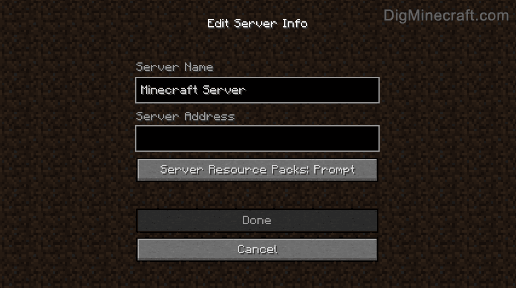

# Setting up a Minecraft gaming server on an Azure VM

This is a rough guide of the steps I took to spin up and configure a Microsoft Azure VM to run a public Minecraft server (for my 6 year old son and his friends, not for me obviously).    


# Set up VM  
Any Virtual Machine will do, but I have chosen the use a Microsoft  Azure VM. For more details see: `template.json`   

Type | Value  
----|----  
vmSize | Standard_B2s  
OS | UbuntuServer 18.04-LTS  
Dedicated Disk | Premium_LRS 20GB

  

# Configure VM    

## Network Security Rules  

The Minecraft server, when launched, will listen on port 25565 by default. Create an inbound security rule on your VM to allow tcp traffic on this port.  


## Firewall  

Allow ssh and port 25565 tcp traffic for minecraft server  
```
sudo ufw enable
sudo ufw allow 22
sudo ufw allow 25565/tcp
sudo ufw status verbose
```
## Storage  

Adding persistent storage to prevent loss if VM is stopped etc.   

Find disk

```
lsblk -o NAME,HCTL,SIZE,MOUNTPOINT | grep -i "sd"
```

Format and partition the disk  (replace `sdd` with however it is labelled above)  

```
sudo parted /dev/{sdd} --script mklabel gpt mkpart xfspart xfs 0% 100%
sudo mkfs.xfs /dev/{sdd1}
sudo partprobe /dev/{sdd1}
```

Mount drive 
```
sudo mkdir /datadrive
sudo mount /dev/sdd1 /datadrive
```

Persist the drive

```
sudo blkid
sudo nano /etc/fstab
```

Add the UUID found above and mount point to the fstab file

```
UUID=ea2f3a0d-0a9c-4b64-a8dc-e737f42b681f   /datadrive   xfs   defaults,nofail   1   2
```  

## Install Software  

Install dependencies  

```
sudo apt update
sudo apt-get install openjdk-17-jdk-headless
sudo apt install screen
```

Download and install minecraft server  

See: https://mcversions.net/ for updated URL. You may wish to create and switch to another {user} for this.  

```
sudo chown -R {user} /datadrive
mkdir /datadrive/server
wget https://launcher.mojang.com/v1/objects/a16d67e5807f57fc4e550299cf20226194497dc2/server.jar -P /datadrive/server
```

## Minecraft Server Setup  

Go to directory with `jar` file.  

```
cd server
```

Run the java file, but expect it to fail as the EULA hasnt been signed.  

```
java -Xmx1024M -Xms1024M -jar server.jar nogui
```

Change to 'true'  

```
nano /datadrive/server/eula.txt
```

Review and update server options. See https://minecraft.fandom.com/wiki/Server.properties

```
nano /datadrive/server/server.properties
```

Launch server in `screen` so closing the terminal window doesn't terminate the server session.  

```
screen
```

Will start MC server with 1GB and run up to 2GB. 

```
java -Xms1024M -Xmx2G -jar server.jar
```

Use `Ctrl+A+D` to detach from `screen` and go back to terminal. `screen -r` will allow re-attach to server screen.  

## Connect  

To connect, you will need to sign-up for a microsoft account and purchase Minecraft. You can then download the launcher and either play in single player mode locally, or use your public Minecraft server to play multiplayer.    

Select multiplayer  

    

Add the public IP of your server and connect.  




# References  

https://docs.microsoft.com/en-us/gaming/azure/reference-architectures/multiplayer-basic-game-server-hosting

https://minecraft.fandom.com/wiki/Tutorials/Setting_up_a_server  


